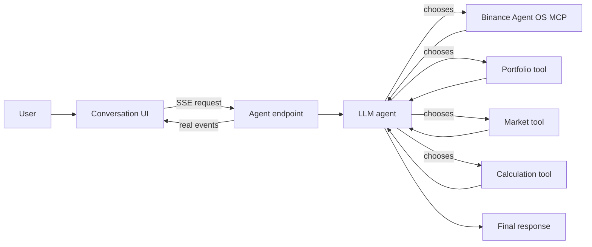

# Portfolio Detective

Portfolio Detective is a conversational AI agent that investigates crypto portfolio movement. The model receives the user's question, chooses tools, observes their results, decides whether more evidence is needed, and writes the final report. Portfolio arithmetic stays in deterministic TypeScript.

## What changed

This is not a button-driven dashboard or a scripted pipeline. The backend implements a model-controlled tool loop with the OpenAI Responses API. The interface streams actual backend events and shows a dashboard only if the agent chose the calculation tool.

## Architecture



The loop continues only while the model returns tool calls:

```text
model decision
  -> execute only requested tools
  -> send tool outputs back to the same response chain
  -> model decides again
  -> stop on a final message
```

## Tools

| Tool | Provenance | Purpose |
| --- | --- | --- |
| `get_portfolio` | Local app tool backed by demo evidence or Binance Spot REST | Retrieve holdings |
| `get_market_data` | Local app tool backed by demo evidence or Binance Spot REST | Retrieve one asset's comparison evidence |
| `calculate_portfolio_contribution` | Local deterministic tool | Calculate values, impacts, contribution, and contributor rankings |
| `get_investigation_context` | Local tool | Review evidence already collected |
| Binance MCP tools | Binance Agent OS | Optional official remote tools supplied directly to the model when an OAuth token is configured |

Tool provenance is included in every event. The UI never labels a local function as a Binance Agent OS MCP tool.

## Binance Agent OS integration

Binance officially provides:

- The remote MCP endpoint `https://agent.binance.com/mcp/agentic`
- Market, account, trading, and internal transfer capabilities controlled by scopes
- Interactive authorization in supported AI clients
- The Binance Skills Hub and official `SKILL.md` conventions

This repository contains an installable skill at `skills/portfolio-detective/SKILL.md`. The agent endpoint can also pass the official MCP endpoint to the OpenAI Responses API as a remote MCP tool when `BINANCE_AGENT_OS_MCP_ACCESS_TOKEN` is configured. Any resulting MCP calls are identified as `binance-agent-os` events.

The boundary is intentional. OpenAI requires an OAuth access token for authenticated remote MCP requests, while Binance currently documents interactive authorization through supported clients rather than a server-side OAuth bootstrap for arbitrary web apps. Therefore:

- The app does not claim MCP is connected when no token is available.
- Demo Mode uses simulated data through local tools while keeping the real model tool loop.
- Live fallback uses signed read-only Binance Spot REST endpoints and labels them `binance-api-local`.
- A Binance API key is never used as an MCP OAuth token.

Official sources:

- [Binance Agent Native overview](https://developers.binance.com/en/docs/agent-native/overview)
- [Official Binance MCP Server](https://developers.binance.com/en/docs/agent-native/mcp-server/agentic)
- [Binance Skills Hub](https://github.com/binance/binance-skills-hub)
- [OpenAI function calling](https://developers.openai.com/api/docs/guides/function-calling)
- [OpenAI remote MCP tools](https://developers.openai.com/api/docs/guides/tools-connectors-mcp)

## Install and run

Requires Node.js 22.13 or newer.

```bash
cd /Users/alinawaz/Developer/portfolio-detective
npm install
cp .env.example .env.local
npm run dev
```

Add at minimum:

```dotenv
OPENAI_API_KEY=your_openai_api_key
OPENAI_MODEL=gpt-5.6-luna
```

Open the local URL printed by the development server. Demo Mode is selected by default.

## Demo Mode

Demo Mode requires an OpenAI API key because the agent is real. It does not require Binance credentials. Holdings and prices are clearly marked as simulated, and the model independently chooses the tool calls.

You can also run the JSON Lines event stream in the terminal:

```bash
npm run agent:investigate -- --demo "Investigate why my portfolio changed in the last 24 hours."
```

## Live Mode

Create a Binance API key with read-only access. Never enable withdrawals or trading for this application.

```dotenv
BINANCE_API_KEY=your_read_only_key
BINANCE_API_SECRET=your_secret
```

Restart the server and switch to Live Mode. The local portfolio tool reads Spot balances; the market tool uses public ticker and candle endpoints.

### Optional official MCP

Only configure this if you have a valid OAuth access token from a supported Binance authorization flow:

```dotenv
BINANCE_AGENT_OS_MCP_URL=https://agent.binance.com/mcp/agentic
BINANCE_AGENT_OS_MCP_ACCESS_TOKEN=your_oauth_access_token
```

The MCP tool is exposed only in Live Mode. Its actual calls appear in the proof panel. Binance does not currently document a generic web-app flow for acquiring this token, so the application does not manufacture one.

## Verification

```bash
npm test
npm run typecheck
npm run build
```

The agent-loop test uses a mocked model transport but real Demo Mode tools. It verifies that model-selected calls execute, function outputs return to the model, the calculation result reaches the final event, and no predefined application workflow drives the order.

## Limitations

- A real acceptance run needs a valid `OPENAI_API_KEY`; without it the server returns a configuration error instead of simulating an agent.
- Binance MCP authentication must be completed through a supported authorization flow outside this web app.
- REST Live Mode covers non-zero Spot balances only.
- Assets without a direct USDT pair stop contribution calculation rather than producing partial totals.
- The comparison uses the previous completed daily close, not transaction cost basis.
- Serverless requests are capped at 60 seconds and 12 model turns.

## Disclaimer

Portfolio Detective provides informational analysis only. It is not investment, tax, trading, or financial advice.
